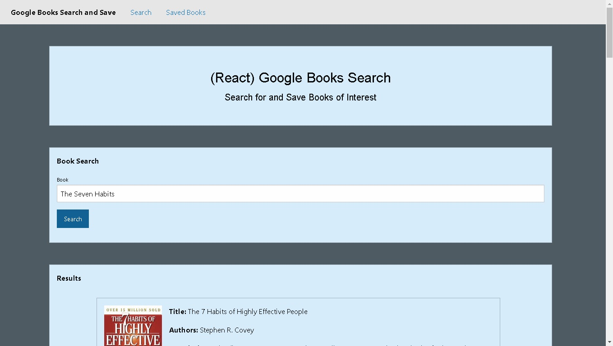

# Google-Books-MERN-app
### This full stack application allows user to connect with the Google Books API, search for books, and save their favorites to a database.

# Deployed on Heroku:
### [Google Books MERN App](https://google-books-full-stack.herokuapp.com/)

# Directories:
* Root
    * [client/](client/)
    * [controllers/](controllers/)
    * [models/](models/)
    * [routes/](routes/)
    * [server.js](server.js)

